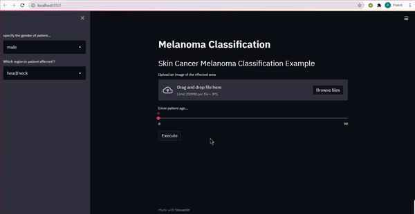

# Melanoma-Skin-Lesion-Classification
Melanoma Skin Cancer Classification using Pytorch and Web App using Streamlit

The purpose of the following project is to correctly identify the benign and malignant cases of Melanoma in images of skin lesions

## Demo

[]

## Table of contents
* [Introduction](#Introduction)
* [Implementation Details](#Implementation_Details)
* [Training Process](#Training_Process)
* [Installation](#Installation)

## Introduction :-
The objective of this project is to identify melanoma in images of skin lesions. In particular, we need to use images 
within the same patient and determine which are likely to represent a melanoma. In other words, 
we need to create a model which should predict the probability whether the lesion in the image 
is malignant or benign.Value 0 denotes benign, and 1 indicates malignant

## Implemenetation_details
* Making a custom class to integrate training of meta data and Images together
* Used transfer learning on Image Net . 

## Training Process
* Used EfficientNet B0-B3 and ResNeXt 
* Loss Function : BCE with logit Loss
* Validation Metric : ROC-AUC Score
* Best Score on validation data : 0.9671
* Best Score on test data : 0.9620
* Epochs Trained : 20* 5Folds with Early Stopping if score doesn't improve
* Optimizer : Adam

## Installation
### Prerequisites

```
PIL
PyTorch
TorchVision
tqdm
OpenCV
Streamlit
```


### 
Download the Model files from the links provided below and upload the whole folder in this repo.

1. <a href="https://drive.google.com/drive/folders/1lh_j0ZSO6iwKmp9gS1f6WYv_BcsPKoNZ?usp=sharing">Model</a>


### Download repository
```
$ git clone https://github.com/rajprakrit/Melanoma-Classification.git
```

After adding the models, and all pre-requisites are met, run the application deployed using streamlit(shown in demo)
```
streamlit run app.py
```
